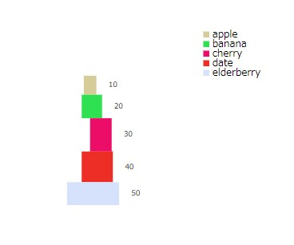
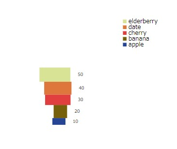
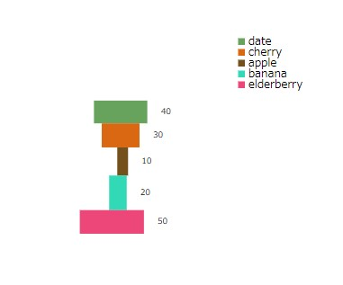

# ToyBlockCharts

## Introduction

Charts that looks like they were made out of toy blocks.  
Please use it as an alternative if you find the expression of pie charts to be stiff.

> This library is currently in the early stages of development.
> We are constantly working to improve and optimize our codebase, which may lead to some breaking changes.
> We recommend regularly checking the latest release logs and documentation.

## Usage

### Stable Balanced



```tsx
<StackedBlockChart
  stackType="stable-balanced"
  data={[
    { name: "apple", value: 10 },
    { name: "banana", value: 20 },
    { name: "orange", value: 30 },
    { name: "grape", value: 40 },
    { name: "kiwi", value: 50 },
  ]}
/>
```

### Unstable Inverted



```tsx
<StackedBlockChart
  stackType="unstable-inverted"
  data={[
    { name: "apple", value: 10 },
    { name: "banana", value: 20 },
    { name: "orange", value: 30 },
    { name: "grape", value: 40 },
    { name: "kiwi", value: 50 },
  ]}
/>
```

### Shuffled



```tsx
<StackedBlockChart
  stackType="shuffled"
  data={[
    { name: "apple", value: 10 },
    { name: "banana", value: 20 },
    { name: "orange", value: 30 },
    { name: "grape", value: 40 },
    { name: "kiwi", value: 50 },
  ]}
/>
```
