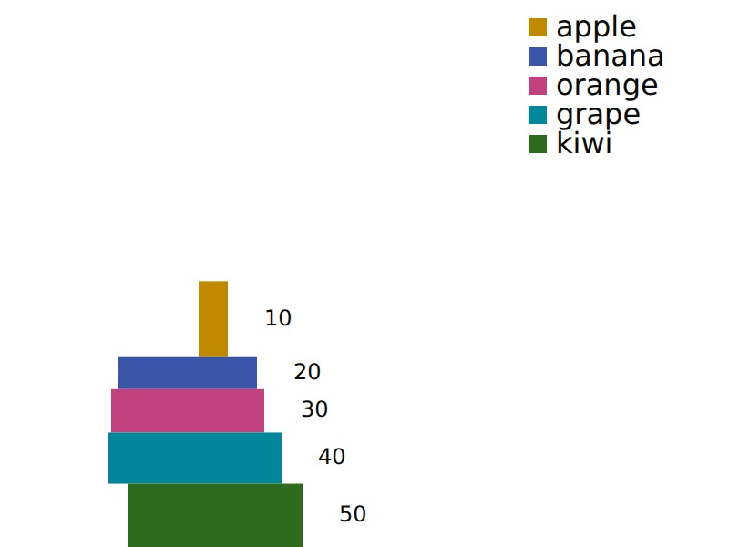
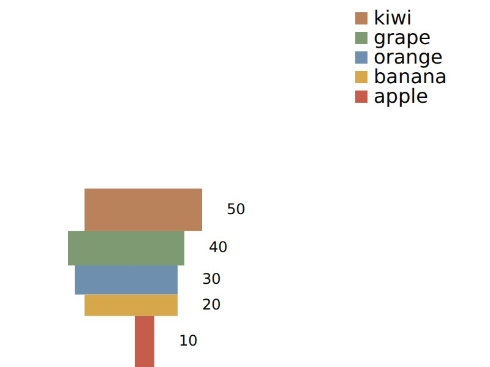
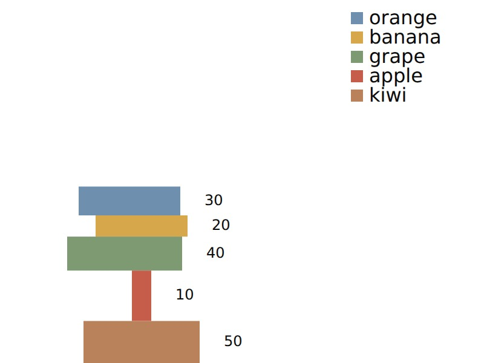

# ToyBlockCharts

## Introduction

Charts that looks like they were made out of toy blocks.  
Please use it as an alternative if you find the expression of pie charts to be stiff.

> This library is currently in the early stages of development.
> We are constantly working to improve and optimize our codebase, which may lead to some breaking changes.
> We recommend regularly checking the latest release logs and documentation.

**[Live examples (Storybook)](https://motinados.github.io/toy-block-charts/)**

## Installation

```
npm install toy-block-charts
```

React 18 or 19 is required as a peer dependency.

## Usage

```tsx
import { StackedBlockChart } from "toy-block-charts";

export function FruitSales() {
  return (
    <StackedBlockChart
      stackType="stable-balanced"
      data={[
        { name: "apple", value: 10 },
        { name: "banana", value: 20 },
        { name: "orange", value: 30 },
      ]}
      title="Fruit sales"
    />
  );
}
```

The chart renders a single `<svg>` with a fixed `viewBox="0 0 400 300"`. By
default it fills the width of its container and keeps its aspect ratio, so size
it with the surrounding layout or with the `width` / `height` props.

Text inside the chart uses `currentColor` and inherits the surrounding font, so
labels and the legend follow the colour and typeface of the page around them.

Layout is randomised but **deterministic**: the same `data` and `seed` always
produce the same chart. Change `seed` to get a different arrangement.

```tsx
<StackedBlockChart stackType="shuffled" data={data} seed={7} />
```

Pass `fill` to choose colours yourself; anything without one is coloured from
the built-in palette.

```tsx
<StackedBlockChart
  stackType="stable-balanced"
  data={[
    { name: "apple", value: 10, fill: "#C04759" },
    { name: "banana", value: 20, fill: "#3B6C73" },
  ]}
/>
```

## API Reference

### `StackedBlockChartProps`

Any other `<svg>` attribute — `className`, `style`, `onClick`, `aria-*` and so
on — is passed straight through, and `ref` is forwarded to the `<svg>` element.

| Prop | Required | Type | Default | Description |
| --- | --- | --- | --- | --- |
| `stackType` | Yes | `stable-balanced \| unstable-inverted \| shuffled` | - | Stacking algorithm type. |
| `data` | Yes | `{ name: string; value: number; fill?: string }[]` | - | Input data for each block segment. Blocks are sized by area, so entries whose `value` is negative or not a finite number are dropped, and a `value` of `0` keeps its legend entry while drawing nothing. If `fill` is omitted the block takes its colour from the palette below. |
| `seed` | No | `number` | `42` | Seed for the randomised layout. The same data and seed always render the same chart. |
| `showDataLabels` | No | `boolean` | `true` | Whether to render value labels beside the blocks. |
| `title` | No | `string` | `"Stacked block chart"` | Accessible name, rendered as `<title>`. Pass `""` to leave the chart unnamed; passing your own `aria-label` or `aria-labelledby` takes precedence over it. |
| `desc` | No | `string` | `undefined` | Longer description, rendered as `<desc>` and referenced by `aria-describedby`. |
| `width` / `height` | No | `ComponentPropsWithRef<"svg">["width"]` / `ComponentPropsWithRef<"svg">["height"]` | `undefined` | SVG size options. They are passed to the `<svg>` `width`/`height` attributes, while `viewBox="0 0 400 300"` is fixed. When specified, they also constrain responsive rendering via `maxWidth` / `maxHeight` styles. |

### Accessibility

The chart is exposed as a single image (`role="img"`) named by `title` and
described by `desc`. Each block also carries a `<title>` of `"name: value"`,
which browsers show as a tooltip on hover.

Because `role="img"` makes the chart a leaf in the accessibility tree, a screen
reader announces the name and description but not the individual values — use
`desc` to summarise the data, or present the numbers alongside the chart.

### Default palette

Data without an explicit `fill` is coloured from this palette, by its position
in the `data` array. A colour therefore stays with its entry no matter how the
layout reorders the blocks.

| Slot | Hex | Slot | Hex |
| --- | --- | --- | --- |
| 1 | `#C08A00` | 5 | `#2F6B1F` |
| 2 | `#3A54A8` | 6 | `#D2622E` |
| 3 | `#C2417F` | 7 | `#7B3FA0` |
| 4 | `#00879B` | 8 | `#C0392B` |

The order was chosen by validating candidate orderings rather than by eye:
against a white background every slot clears a contrast ratio of 3:1 and is
saturated enough not to read as grey, and the first five stay distinguishable
from one another in every pairing, including under simulated colour-vision
deficiency. Colours repeat past the eighth entry, so charts with more categories
than that are better served by explicit `fill` values.

### Stable Balanced



```tsx
<StackedBlockChart
  stackType="stable-balanced"
  data={[
    { name: "apple", value: 10 },
    { name: "banana", value: 20 },
    { name: "orange", value: 30 },
    { name: "grape", value: 40 },
    { name: "kiwi", value: 50 },
  ]}
/>
```

### Unstable Inverted



```tsx
<StackedBlockChart
  stackType="unstable-inverted"
  data={[
    { name: "apple", value: 10 },
    { name: "banana", value: 20 },
    { name: "orange", value: 30 },
    { name: "grape", value: 40 },
    { name: "kiwi", value: 50 },
  ]}
/>
```

### Shuffled



```tsx
<StackedBlockChart
  stackType="shuffled"
  data={[
    { name: "apple", value: 10 },
    { name: "banana", value: 20 },
    { name: "orange", value: 30 },
    { name: "grape", value: 40 },
    { name: "kiwi", value: 50 },
  ]}
/>
```

## Acknowledgment of Color Scheme

The colours used in the examples and stories are taken from
["ColorLisa"](https://colorlisa.com/).
